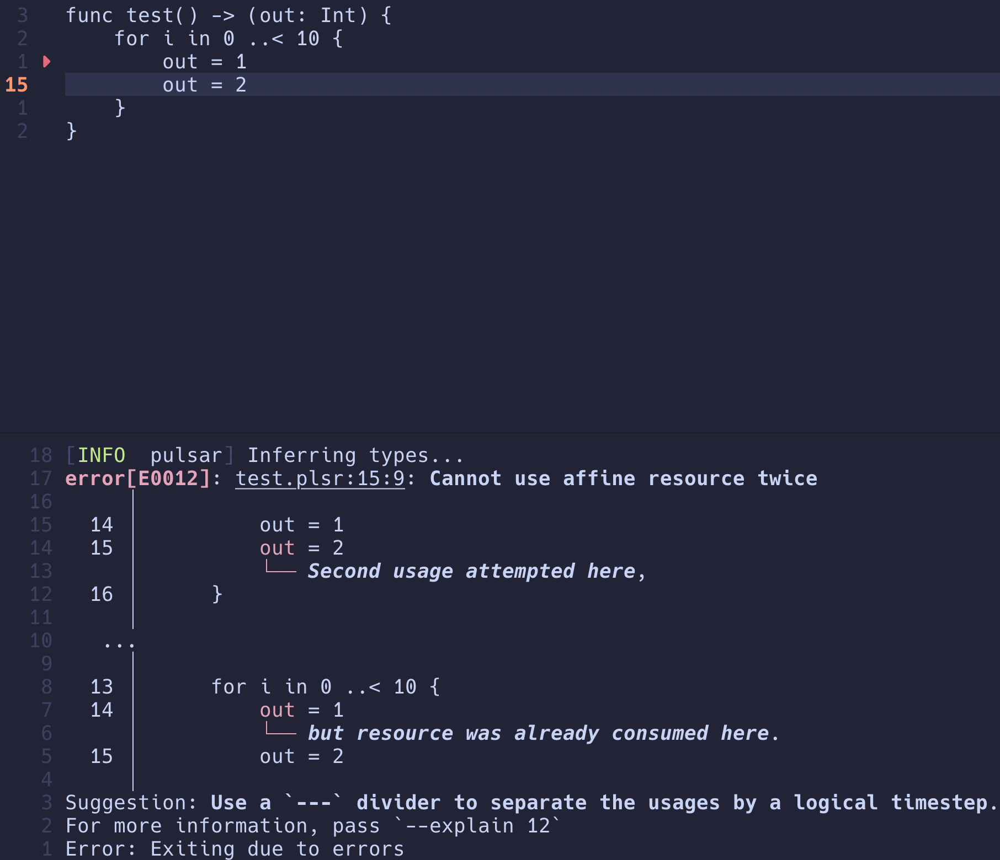

# pulsar


[](https://www.codefactor.io/repository/github/ethanuppal/pulsar)

Pulsar is a programming language for building hardware accelerators with
zero-latency memory access, which is achieved by:

1. Disallowing data-dependent addressing
2. Requiring all root control to have fully-resolved static timing

The language is currently under development, but a significant portion is
functional.
Here's an example of what it will be able to do once feature-complete:

```swift
struct Complex {
    re: Double,
    im: Double
}

func fft<FFT_SIZE>(input: Complex[FFT_SIZE], twid: Complex[FFT_SIZE / 2]) -> (output: Int) {
    for log in 0 ..< LOG2_FFT_SIZE {
        let span = FFT_SIZE >> (log + 1)
        for odd in span ..< FFT_SIZE {
            let odd = odd | span
            let even = odd ^ span
            let temp = input[even].re + input[odd].re
            ---
            input[odd].re = input[even].re - input[odd].re
            ---
            input[even].re = temp
            // ...
        }
    }
}
```

## Introduction

You can declare hardware modules with the `func` keyword, specifying inputs and
outputs.
Types include primitive integers, `struct`s, and (multi-dimensional) arrays.
A `struct` cannot contain an array.

Operations which depend on each other or correspond to sequential logic must be
gated between dividers (`---`).
For example, a divider must be placed after multiplication but does not need to
be placed after addition (which is purely combinational).

A lot of care has been put into good error messages.
To quote the developers of [spade](https://spade-lang.org),

> Bad error messages are considered a bug. Please report them!



<!-- The [calyx] backend is tested e2e via [verilator], a hardware simulation tool. -->

## Crates

- [`pulsar-lang`](https://crates.io/crates/pulsar-lang): Compiler driver
- [`pulsar-utils`](https://crates.io/crates/pulsar-utils): Utilities for the `pulsar-*` crates
- [`pulsar-frontend`](https://crates.io/crates/pulsar-frontend): Parser/AST and type checking
- [`pulsar-ir`](https://crates.io/crates/pulsar-ir): IR definition and optimization
- [`pulsar-backend`](https://crates.io/crates/pulsar-backend): Target emission, e.g., Verilog (via [calyx])
- [`calyx-builder`](/calyx-builder): API for building [calyx] IR

## License

Pulsar is free software: you can redistribute it and/or modify it under the terms of the GNU General Public License as published by the Free Software Foundation, either version 3 of the License, or (at your option) any later version.

Pulsar is distributed in the hope that it will be useful, but WITHOUT ANY WARRANTY; without even the implied warranty of MERCHANTABILITY or FITNESS FOR A PARTICULAR PURPOSE. See the GNU General Public License for more details.

A copy of the GNU General Public License, version 3, can be found in the [LICENSE](LICENSE) file.

[calyx]: http://calyxir.org
